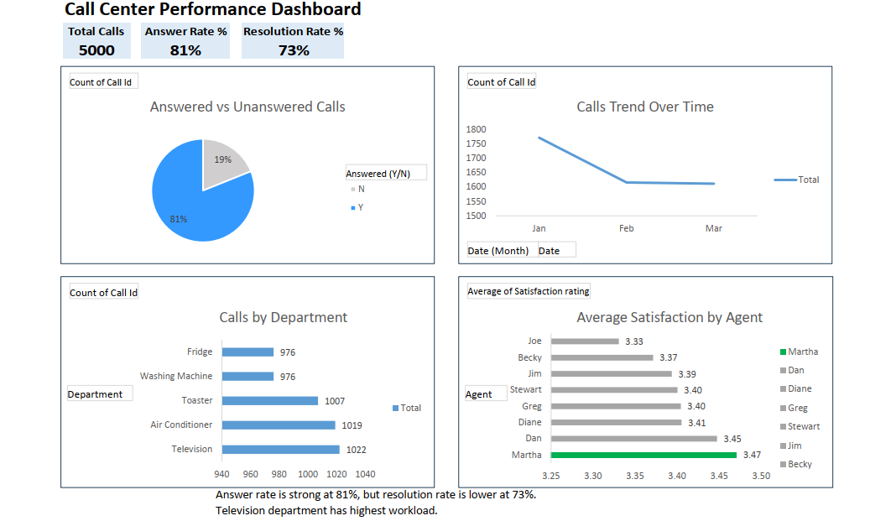

# Call Center Performance Dashboard

An interactive Excel dashboard analysing 5,000 call center records.

## Tools Used
- Microsoft Excel (Pivot Tables, Slicers, Charts)

## Key Metrics
- Total Calls: 5,000
- Answer Rate: 81%
- Resolution Rate: 73%
- Agent satisfaction scores and department-wise call volume

## Dashboard Preview

## Author
Jitender | MIS Executive → Data Analyst 
| Data Analyst Portfolio | 2026
